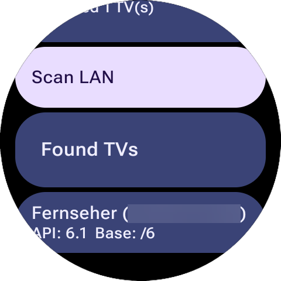
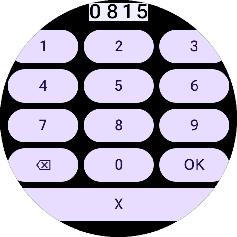

# Phreemote – TV-Steuerung für die Galaxy Watch

Phreemote verwandelt deine **Galaxy Watch** in eine kompakte Fernbedienung für deinen Fernseher.

Die App funktioniert **nur mit Fernsehern, die eine JointSpace-API bereitstellen**. Getestet werden konnte bislang **nur API-Version 6**. Wenn du einen Fernseher mit einer **anderen JointSpace-API-Version** verwendest, freue ich mich über **Erfahrungsberichte und Beiträge aus der Community**, damit die Kompatibilität besser eingeschätzt und weiter verbessert werden kann.

Der wichtigste Schritt bei der ersten Nutzung ist das **Pairing** zwischen Uhr und Fernseher. Dieses README richtet sich in erster Linie an **Anwender** und erklärt vor allem genau diesen Vorgang.

## Inhaltsverzeichnis

- [Was die App macht](#was-die-app-macht)
- [Voraussetzungen](#voraussetzungen)
- [Erste Einrichtung](#erste-einrichtung)
- [Pairing – Schritt für Schritt](#pairing--schritt-für-schritt)
  - [1. Fernseher suchen](#1-fernseher-suchen)
  - [2. Fernseher auswählen](#2-fernseher-auswählen)
  - [3. Pairing-Code am Fernseher ablesen](#3-pairing-code-am-fernseher-ablesen)
  - [4. Code auf der Uhr eingeben](#4-code-auf-der-uhr-eingeben)
  - [5. Kopplung bestätigen](#5-kopplung-bestätigen)
  - [6. Fernbedienung verwenden](#6-fernbedienung-verwenden)
- [Wenn das Pairing nicht klappt](#wenn-das-pairing-nicht-klappt)
- [Kurzfassung](#kurzfassung)
  - [Erste Nutzung](#erste-nutzung)
- [Lizenz](#lizenz)

## Was die App macht

Phreemote verwandelt deine Galaxy Watch in eine kompakte TV-Fernbedienung.  
Nach erfolgreicher Kopplung kannst du – je nach TV-Unterstützung – typische Fernbedienungsfunktionen direkt auf der Uhr nutzen.

## Voraussetzungen

Vor dem ersten Verbinden sollten folgende Punkte erfüllt sein:

- Die **Galaxy Watch** und der **Fernseher** befinden sich im **selben Netzwerk**
- Der Fernseher ist **eingeschaltet**
- Die TV-Steuerung über Netzwerk ist auf dem Fernseher grundsätzlich verfügbar
- Während des ersten Verbindens solltest du **in der Nähe des Fernsehers** sein, da auf dem TV ein Pairing-Code angezeigt werden kann

## Erste Einrichtung

Beim ersten Start der App gelangst du in den **Setup-Bereich**.

Dort sucht die App im Netzwerk nach kompatiblen Fernsehern.  
Wird ein TV gefunden, kannst du ihn auswählen und anschließend koppeln.

Der typische Ablauf sieht so aus:

1. App auf der Uhr öffnen
2. **LAN-Scan** starten
3. Gefundenen Fernseher auswählen
4. Pairing-Code auf dem Fernseher ablesen
5. Code auf der Uhr eingeben
6. Verbindung bestätigen
7. Danach kann die Fernbedienung genutzt werden

# Pairing – Schritt für Schritt

## 1. Fernseher suchen

Im Setup startest du die Suche nach Fernsehern im lokalen Netzwerk.

Die App versucht dabei:

- Geräte im Netzwerk zu finden
- erkannte Geräte zu prüfen
- kompatible TVs in einer Liste anzuzeigen

Sobald dein Fernseher in der Liste erscheint, kannst du ihn antippen.

## 2. Fernseher auswählen

Nach dem Antippen des gefundenen TVs startet der Kopplungsvorgang.

Je nach TV kann nun auf dem Fernseher ein Hinweis erscheinen, dass eine neue Fernbedienung bzw. ein neues Gerät verbunden werden möchte.

## 3. Pairing-Code am Fernseher ablesen

Während der Kopplung zeigt der Fernseher in der Regel einen **mehrstelligen Code** an.

Dieser Code ist nur kurzzeitig gültig und dient dazu, die Verbindung zwischen Uhr und TV eindeutig zu bestätigen.

## 4. Code auf der Uhr eingeben

Auf der Uhr erscheint ein **Ziffernfeld**.

Dort gibst du den auf dem Fernseher angezeigten Code ein:

- Ziffern antippen
- mit **Backspace** korrigieren, falls nötig
- mit **OK** bestätigen
- mit **Cancel** abbrechen

Wichtig:  
Gib den Code möglichst direkt und ohne lange Verzögerung ein, damit er nicht abläuft.

## 5. Kopplung bestätigen

Wenn der Code korrekt war, wird das Pairing abgeschlossen.

Danach gilt der Fernseher als **gekoppelt** bzw. **vertrauenswürdig**.  
Ab diesem Zeitpunkt musst du den Pairing-Vorgang normalerweise **nicht bei jeder Nutzung wiederholen**.

## 6. Fernbedienung verwenden

Nach erfolgreichem Pairing wechselt die App zur Fernbedienungsansicht.

Dort kannst du den TV direkt über die Uhr bedienen.

# Wenn das Pairing nicht klappt

Falls die Verbindung nicht sofort funktioniert, helfen meist diese Punkte:

## Uhr und TV im selben Netzwerk?
Die häufigste Ursache ist, dass Uhr und Fernseher nicht im gleichen lokalen Netzwerk erreichbar sind.

## Fernseher wirklich eingeschaltet?
Der Fernseher sollte vollständig eingeschaltet sein, nicht nur im unklaren Standby-Zustand.

## Pairing-Code korrekt eingegeben?
Schon eine falsche Ziffer verhindert die Kopplung.  
Im Zweifel den Vorgang erneut starten und den Code noch einmal sorgfältig eingeben.

## Code abgelaufen?
Wenn die Eingabe zu lange dauert, kann der Code ungültig werden.  
Dann den Pairing-Vorgang einfach neu starten.

## TV zwar gefunden, aber keine Verbindung?
Dann erneut scannen, den TV noch einmal auswählen und die Kopplung wiederholen.

## Früher gekoppelt, jetzt Probleme?
In solchen Fällen hilft oft:

- App neu öffnen
- TV erneut auswählen
- Kopplung erneut durchführen

# Kurzfassung

## Erste Nutzung

1. App öffnen  
2. TV suchen  
3. TV auswählen  
4. Pairing-Code vom Fernseher ablesen  
5. Code auf der Uhr eingeben  
6. Bestätigen  
7. Fertig

--

## Lizenz
[`MIT`](./LICENSE)
