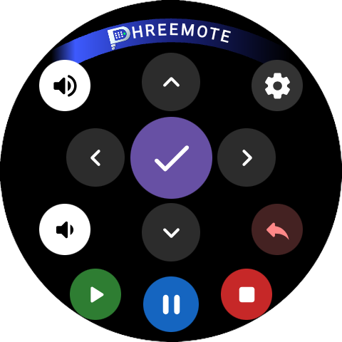
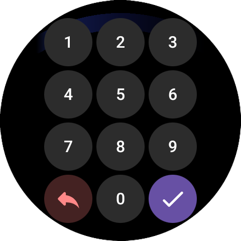
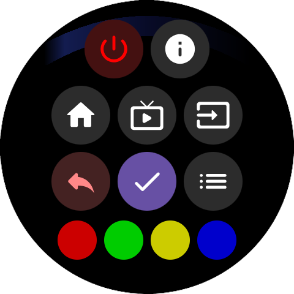

# Phreemote – TV Control for Galaxy Watch

Phreemote turns your **Galaxy Watch** into a compact remote control for your TV.

The app works **only with TVs that provide a JointSpace API**. So far, **only API version 6** could be tested. If you are using a TV with a **different JointSpace API version**, I would be happy to receive **feedback and community contributions** so compatibility can be assessed more reliably and improved over time.

The most important step during first-time use is the **pairing** process between the watch and the TV. This README is mainly written for **end users** and focuses especially on that process.

## Table of Contents

- [What the app does](#what-the-app-does)
- [Requirements](#requirements)
- [Initial setup](#initial-setup)
- [Pairing – step by step](#pairing--step-by-step)
  - [1. Search for the TV](#1-search-for-the-tv)
  - [2. Select the TV](#2-select-the-tv)
  - [3. Read the pairing code on the TV](#3-read-the-pairing-code-on-the-tv)
  - [4. Enter the code on the watch](#4-enter-the-code-on-the-watch)
  - [5. Confirm the pairing](#5-confirm-the-pairing)
  - [6. Use the remote](#6-use-the-remote)
- [If pairing does not work](#if-pairing-does-not-work)
- [Quick summary](#quick-summary)
  - [First use](#first-use)

## What the app does

Phreemote turns your Galaxy Watch into a compact TV remote.  
After successful pairing, you can use typical remote-control functions directly from the watch, depending on your TV's support.

## Requirements

Before connecting for the first time, make sure the following conditions are met:

- The **Galaxy Watch** and the **TV** are connected to the **same network**
- The TV is **powered on**
- Network-based TV control is generally available on the TV
- During the first connection, you should be **near the TV**, because a pairing code may be shown on the screen

## Initial setup

When you launch the app for the first time, you will enter the **setup area**.

There, the app searches the network for compatible TVs.  
If a TV is found, you can select it and then pair it.

The usual process looks like this:

1. Open the app on the watch
2. Start the **LAN scan**
3. Select the detected TV
4. Read the pairing code shown on the TV
5. Enter the code on the watch
6. Confirm the connection
7. Then the remote can be used

# Pairing – step by step

## 1. Search for the TV

In setup, start the search for TVs on your local network.

The app will try to:

- find devices on the network
- verify detected devices
- show compatible TVs in a list

As soon as your TV appears in the list, tap it.

## 2. Select the TV

After tapping the detected TV, the pairing process starts.

Depending on the TV, a message may now appear on the television saying that a new remote or device wants to connect.

## 3. Read the pairing code on the TV

During pairing, the TV usually shows a **multi-digit code**.

This code is only valid for a short time and is used to clearly confirm the connection between the watch and the TV.

## 4. Enter the code on the watch

]

A **numeric keypad** appears on the watch.

Enter the code shown on the TV there:

- tap digits
- use **Backspace** to correct input if needed
- confirm with **OK**
- cancel with **Cancel**

Important:  
Enter the code as directly as possible and without taking too long, otherwise it may expire.

## 5. Confirm the pairing

If the code was correct, pairing is completed.

After that, the TV is considered **paired** or **trusted**.  
Normally, you do **not** need to repeat the pairing process every time you use the app.

## 6. Use the remote

After successful pairing, the app switches to the remote control screen.

You can then control the TV directly from your watch.

# If pairing does not work

If the connection does not work immediately, these checks usually help:

## Are the watch and TV on the same network?
The most common cause is that the watch and TV are not reachable within the same local network.

## Is the TV really turned on?
The TV should be fully powered on, not in an unclear standby state.

## Was the pairing code entered correctly?
A single wrong digit will prevent pairing.  
If necessary, restart the process and enter the code again carefully.

## Did the code expire?
If entering the code takes too long, it may become invalid.  
In that case, simply restart the pairing process.

## TV found, but still no connection?
Then scan again, select the TV once more, and repeat the pairing.

## Was it paired before, but now it has problems?
In such cases it often helps to:

- reopen the app
- select the TV again
- perform pairing again

# Quick summary

## First use

1. Open the app  
2. Search for the TV  
3. Select the TV  
4. Read the pairing code from the TV  
5. Enter the code on the watch  
6. Confirm  
7. Done
