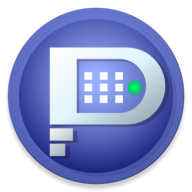
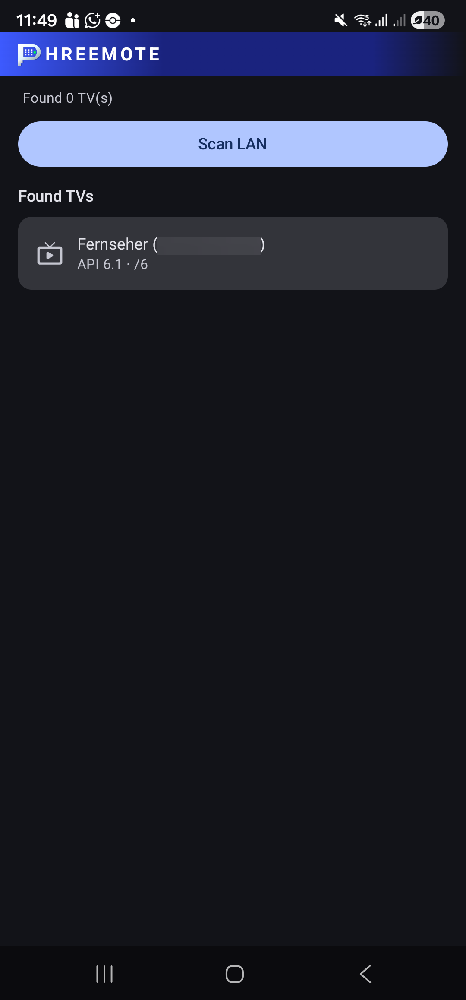
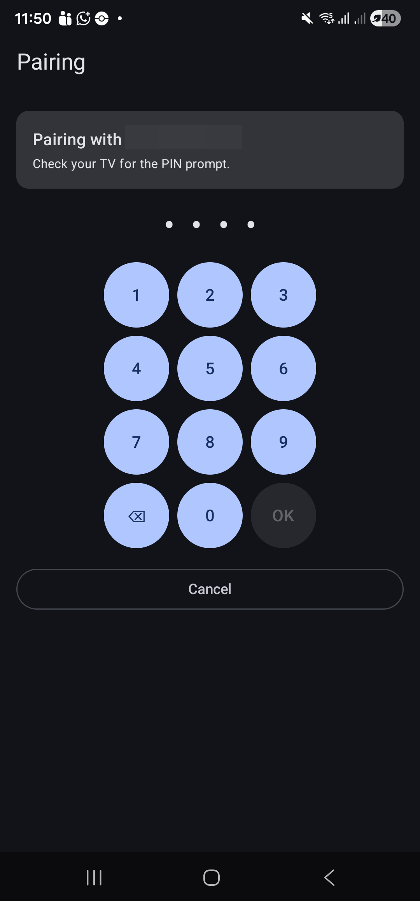
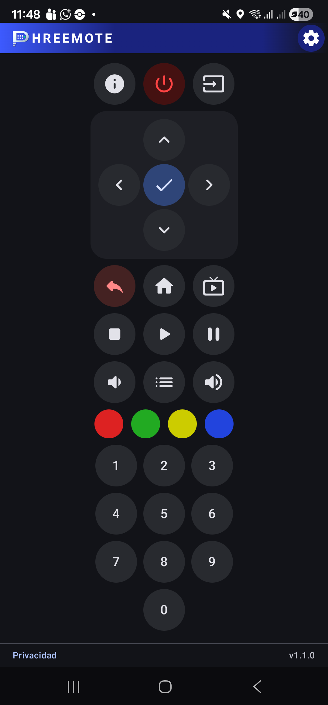

# Phreemote – Philips TV Control for Android & Wear OS

Phreemote turns your **Android phone** or **Wear OS watch** into a remote control for your Philips TV.

> The app works **only with TVs that provide a JointSpace API**. API version 6 has been tested. If you use a TV with a **different JointSpace API version**, feedback and community contributions are welcome.

---

## Table of Contents

- [Requirements](#requirements)
- [Android App](#android-app)
- [Wear OS App](#wear-os-app)
- [First-time setup & pairing](#first-time-setup--pairing)
  - [1. Search for the TV](#1-search-for-the-tv)
  - [2. Select the TV](#2-select-the-tv)
  - [3. Read the pairing code on the TV](#3-read-the-pairing-code-on-the-tv)
  - [4. Enter the code](#4-enter-the-code)
  - [5. Done](#5-done)
- [If pairing does not work](#if-pairing-does-not-work)
- [License](#license)

---

## Requirements

- Your **phone or watch** and the **TV** must be on the **same local network**
- The TV must be **fully powered on** (not in standby)
- Stay **near the TV** during the first pairing — the TV will display a code on screen

---

## Android App

| Scan for TV | Pairing | Remote control |
|:-----------:|:-------:|:--------------:|
|  |  |  |

The phone app offers a full-screen remote with all common TV functions.  
Phone and watch pair **independently** — pairing on the phone does not affect the watch, and vice versa.

---

## Wear OS App

| Main remote | Numpad | More functions |
|:-----------:|:------:|:--------------:|
|  |  |  |

The Wear OS app is designed for round watch displays. Swipe left or right to switch between the main remote, numpad, and extra functions.

---

## First-time setup & pairing

Both apps go through the same setup flow when launched for the first time.

### 1. Search for the TV

| Phone | Watch |
|:-----:|:-----:|
|  |  |

Tap **Scan LAN** to search the local network for compatible TVs.  
The app will detect, probe, and list any compatible devices it finds.  
As soon as your TV appears in the list, tap it.

### 2. Select the TV

After tapping the TV, pairing starts automatically.  
The TV may show a message that a new device is requesting a connection.

### 3. Read the pairing code on the TV

The TV will display a **multi-digit code** on screen.  
This code is only valid for a short time — have it ready before proceeding.

### 4. Enter the code

| Phone | Watch |
|:-----:|:-----:|
|  |  |

A **numeric keypad** appears on the app.

- Tap the digits shown on the TV
- Use **Backspace (⌫)** to correct a mistake
- Confirm with **OK**
- Cancel with **✕** to go back to the TV list

Enter the code promptly — it will expire if you take too long.

### 5. Done

If the code was correct, the TV is now **paired**.  
The app switches directly to the remote control.  
You do **not** need to pair again on future launches.

---

## If pairing does not work

**Phone/watch and TV not on the same network?**  
The most common cause. Check that both devices use the same Wi-Fi network.

**TV not fully on?**  
Make sure the TV is fully started, not in standby.

**Wrong code entered?**  
One wrong digit is enough to fail. Restart the pairing and re-enter carefully.

**Code expired?**  
If entering takes too long, the code expires. Simply start pairing again.

**Still not working?**  
Tap **Remove TV** in the setup screen, scan again, and repeat the pairing from scratch.

---

## License

[`MIT`](./LICENSE)
